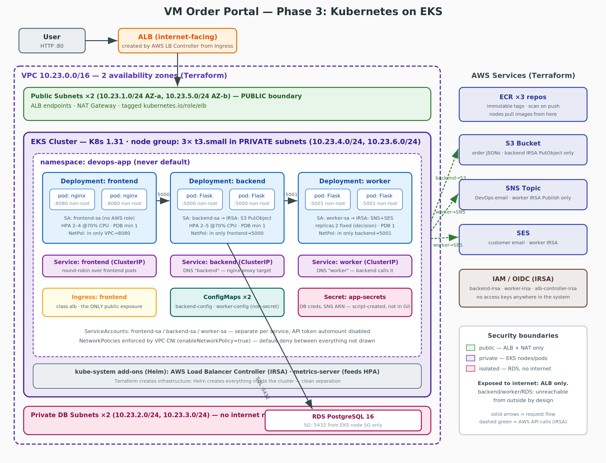

# VM Order Portal — Phase 3: Kubernetes on AWS EKS

The application from phases 1–2 (frontend + backend + worker, connected to RDS/S3/SNS/SES), now running as containers in a Kubernetes cluster. Terraform creates the infrastructure; Helm deploys the application; **no Ansible, no `.env` files, no access keys anywhere**.



*(Diagram source: `docs/architecture.svg`)*

## Architecture in one paragraph

Users reach an internet-facing **ALB** (created automatically by the AWS Load Balancer Controller from our Ingress). The ALB forwards to **frontend pods** (nginx, non-root, port 8080) in a dedicated namespace `devops-app` inside an **EKS cluster of 3 private nodes**. nginx proxies `/api/` to the **backend Service** by DNS name — no IPs anywhere. Backend pods write orders to **RDS PostgreSQL** (isolated DB subnets, reachable only from the node security group) and order JSONs to **S3** (via IRSA — no keys), then call the **worker Service**, whose pods send notifications via **SNS + SES** (also IRSA). Every service has its own ServiceAccount, NetworkPolicy, resource limits, probes, and PodDisruptionBudget.

## What runs where

| Inside Kubernetes | Outside the cluster (AWS, via Terraform) |
|---|---|
| frontend ×2 (nginx), backend ×2 (Flask), worker ×2 (Flask) | RDS PostgreSQL 16 |
| Services, Ingress, ConfigMaps, Secret, ServiceAccounts, HPAs, NetworkPolicies, PDBs | S3 bucket (order JSONs) |
| Add-ons: AWS LB Controller, metrics-server | SNS topic, SES |
| | ECR ×3, IAM/OIDC (IRSA), VPC/subnets/NAT |

**Division of labor (assignment requirement):** Terraform creates *everything outside the cluster* plus the cluster itself. Helm/kubectl create *everything inside* the cluster. Nothing overlaps.

## Repository layout

```
docker/     Dockerfile per service + nginx.conf (proxies to Service DNS)
app/        application code — unchanged since phase 2
terraform/  VPC, EKS, ECR, IRSA, RDS, S3, SNS (7 modules)
helm/       three independent charts: backend/ worker/ frontend/
scripts/    build-images.sh, create-secret.sh, deploy.sh, destroy.sh
k8s/        secret.example.yaml (placeholders only)
docs/       architecture diagram, Trivy reports
```

## Prerequisites

`aws` CLI (configured), `terraform` ≥ 1.5, `docker`, `kubectl`, `helm` ≥ 3, and optionally `trivy`. One-time AWS needs: an SES-verified sender email.

## How to run everything

```bash
# 1. Configure — the ONLY file you edit:
cp terraform/terraform.tfvars.example terraform/terraform.tfvars
#    fill in: db_password, s3_bucket_name (lowercase!), notification_email, ses_sender, github_repo_url

# 2. (Optional, recommended) remote Terraform state:
cd terraform && ./bootstrap-state.sh && cd ..

# 3. Deploy everything (~25-30 min, mostly EKS creation):
./scripts/deploy.sh            # prints the app URL at the end

# 4. Destroy everything when done (~15 min, back to $0/hour):
./scripts/destroy.sh
```

What deploy.sh does, in order: `terraform apply` → connect kubectl → build/push images (with Trivy scan) → install LB Controller + metrics-server → create namespace + Secret → `helm upgrade --install` backend, worker, frontend → wait for rollouts → print ALB URL.

### Doing the steps manually (understanding checklist)

```bash
# Build & push images (repos must exist — terraform first):
./scripts/build-images.sh 1.0.0

# Namespace:
kubectl create namespace devops-app

# Secret (real values from Terraform outputs — see k8s/secret.example.yaml):
./scripts/create-secret.sh

# Charts (values injected via --set; see deploy.sh for the full flag list):
helm upgrade --install backend  ./helm/backend  -n devops-app --set ...
helm upgrade --install worker   ./helm/worker   -n devops-app --set ...
helm upgrade --install frontend ./helm/frontend -n devops-app --set ...
```

## How to verify the system works

```bash
kubectl get nodes                          # 3 Ready nodes
kubectl get pods -n devops-app             # 6 Running pods (2+2+2)
kubectl get ingress -n devops-app          # ALB hostname
curl http://<ALB>/healthz                  # frontend alive
curl http://<ALB>/api/health               # frontend→backend chain alive
# Place an order in the browser → email arrives (worker→SNS/SES),
# JSON appears in S3 (backend→S3), row appears in RDS.
kubectl delete pod <backend-pod> -n devops-app && kubectl get pods -w
#   → replacement pod appears in seconds; the site keeps working
kubectl get hpa -n devops-app              # autoscaling status
```

## How to delete the environment

`./scripts/destroy.sh`. Order matters and is encoded in the script: Helm uninstall first (the frontend chart's removal deletes the Ingress, which makes the controller delete the ALB), *wait for the ALB to disappear*, then `terraform destroy`. Destroying Terraform first would fail — the ALB is not Terraform-managed and would block VPC deletion.

---

# Security

## Permission separation (ServiceAccounts + IRSA)

Each Deployment runs under its **own ServiceAccount** — no sharing:

| ServiceAccount | IAM role (IRSA) | AWS permissions |
|---|---|---|
| `frontend-sa` | **none** | none — nginx needs zero AWS access |
| `backend-sa` | `vm-order-prod-backend-irsa` | `s3:PutObject` on our bucket only |
| `worker-sa` | `vm-order-prod-worker-irsa` | `sns:Publish` on our topic only + `ses:SendEmail` |

Why not one broad role for everything: a compromised frontend pod could then write to S3 and send emails as us; a compromised backend could spam SNS. With per-service roles, a breach is contained to that service's minimal blast radius. **IRSA** ties each IAM role cryptographically (via the cluster's OIDC provider) to exactly one `namespace/serviceaccount` pair — pods receive short-lived credentials automatically, and **no access keys exist anywhere** in code, images, Git, or Kubernetes objects.

Additionally, all three ServiceAccounts set `automountServiceAccountToken: false`: our pods never call the Kubernetes API, so they don't even carry an API token to steal.

## RBAC

We define **no Roles or RoleBindings** — deliberately. RBAC governs access to the *Kubernetes API*, and none of our application pods talk to the API at all. Granting zero API permissions *is* the least-privilege answer here (and with token automount disabled, pods couldn't use permissions even if granted). The cluster admin (you, via `aws eks update-kubeconfig`) authenticates through AWS IAM. No workload has anything close to cluster-admin.

## Secrets management

- Runtime secrets (`DB_HOST`, `DB_PASSWORD`, `SNS_TOPIC_ARN`, `SES_SENDER`) live in one Kubernetes Secret, `app-secrets`, injected as env vars via `envFrom`.
- It is created by `scripts/create-secret.sh` from **Terraform outputs + terraform.tfvars** — single source of truth, same philosophy as our phase 2 Ansible-vault generation.
- Git contains only `k8s/secret.example.yaml` with placeholders; `terraform.tfvars` is git-ignored.
- We used Kubernetes Secrets only (no external operator). Trade-off acknowledged: K8s Secrets are base64-encoded, not encrypted, in etcd — EKS mitigates this by encrypting etcd at rest. Production upgrade path: External Secrets Operator + AWS Secrets Manager.

## Network security

Enforced by **NetworkPolicies** (VPC CNI with `enableNetworkPolicy=true` — set in Terraform, because without it EKS silently ignores policies):

| Who | May be called by | On port | May call out to |
|---|---|---|---|
| frontend | VPC sources (the ALB) | 8080 | backend:5000, DNS |
| backend | frontend pods only | 5000 | worker:5001, RDS:5432, AWS APIs:443, DNS |
| worker | backend pods only | 5001 | RDS:5432, AWS APIs:443, DNS |
| RDS | EKS node security group only | 5432 | — |

Everything not listed is denied. **Exposed to the internet: the ALB only.** Backend, worker, and RDS have no public IPs, no ingress path from outside, and live in private/isolated subnets — the phase 2 network philosophy, carried into the cluster.

## Container security

Every container runs with: `runAsNonRoot: true` (backend/worker as a dedicated `appuser`; frontend uses the official *unprivileged* nginx image, which is also why it listens on 8080 — non-root can't bind below 1024), `allowPrivilegeEscalation: false`, `readOnlyRootFilesystem: true` (with an `emptyDir` mounted at `/tmp` for scratch space; `PYTHONDONTWRITEBYTECODE=1` so Python doesn't try to write), `capabilities: drop [ALL]`, and `seccompProfile: RuntimeDefault`.

## Image security

- Images are **built by us** from official pinned bases (`python:3.12-slim`, `nginxinc/nginx-unprivileged:1.27-alpine`) — Dockerfiles in `docker/`.
- Tags are **pinned versions, never `latest`**, and ECR repositories are **IMMUTABLE** — a pushed tag can never be silently replaced, so the running code is always exactly identifiable.
- No secrets in images: config arrives at runtime via env; `.dockerignore` excludes `.env` and everything non-app.
- Scanning, twice: **Trivy** locally on every build (`build-images.sh`, report in `docs/`) and in CI (fails the pipeline on CRITICAL), plus ECR **scan-on-push**.

## Ingress security

The app is exposed exclusively through one Ingress → one internet-facing ALB → frontend Service. Backend and worker have no Ingress and ClusterIP Services only — unreachable from outside by construction. **HTTP only — documented trade-off:** HTTPS requires a domain name + ACM certificate, which this exercise doesn't include; the upgrade is two annotations (`certificate-arn`, `listen-ports` with HTTPS) once a domain exists. Public traffic (ALB→frontend) and internal traffic (pod↔pod, pod→RDS) are fully separated; internal traffic never leaves the VPC, and S3 calls use the free Gateway VPC Endpoint.

---

## Design decisions & trade-offs (the "why" list)

- **3 nodes** — survives a node failure with capacity to spare; demos pod spreading; ~$0.06/hour total for nodes.
- **Replicas 2/2/2 with topology spread** — every service survives node loss with zero downtime. Worker at 2 (not 1): it's push-driven via its Service (round-robin), so no duplicate-email risk, and the surviving replica takes traffic instantly during node failure. Soft spread (`ScheduleAnyway`) chosen over hard: better two replicas on one node than a pod stuck Pending during an outage.
- **HPA on frontend (2–4) and backend (2–5) at 70% CPU; worker fixed** — email volume is tiny; autoscaling it would be decoration. CPU as the scaling metric (not request count) — request-based scaling needs a Prometheus adapter; CPU is the standard proxy with one moving part instead of four.
- **Chart per service** (course requirement) — independent upgrades/rollbacks per service (`helm rollback backend` touches nothing else). Cost: shared values are passed to each chart separately. Note: *scaling* was never chart-dependent — replicas/HPA belong to Deployments.
- **Single NAT Gateway** — ~$32/month if left running vs. per-AZ NAT in production; for deploy-test-destroy cycles the cost is cents.
- **RDS outside the cluster** (option 1 of the assignment) — reusing the phase 2 approach; databases want stable storage and managed backups, which pods don't naturally provide.
- **EKS + IRSA over kind + access keys** — costs ~$0.20–0.50 per full test cycle but eliminates long-lived credentials entirely.

## Lessons from the live deployment (encoded as fixes + regression tests)

1. **Kubelet rejects `runAsNonRoot` with a named user** — Dockerfiles now use numeric `USER 10001`.
2. **`COPY` preserves source file permissions** — 600-permission files from a zip extraction poisoned the images (nginx couldn't read its own config). All `COPY` lines now use `--chmod=0644`.
3. **Kubernetes does not restart pods on ConfigMap/Secret changes** — deployments carry a config checksum annotation, and `create-secret.sh` restarts consumers when the Secret changes.
4. **The ALB controller chart and its IAM policy must be version-pinned together** — an unpinned chart pulled a newer controller needing permissions the vendored policy lacked (`AccessDenied`). The chart version is pinned in `deploy.sh` and recorded in `terraform/modules/irsa/ALB_CONTROLLER_VERSION`, matching the vendored policy.
5. **Teardown hardening**: destroy.sh deletes the controller webhooks first, empties the S3 bucket including versioned objects (plus `force_destroy` on the bucket), and sweeps orphaned EKS network interfaces with a retry — each step corresponds to a real teardown failure.

Every lesson above is guarded by a regression test in `tests/run_all.sh` (group T12).

## Known manual steps

1. Confirm the SNS subscription email after the first `terraform apply` (AWS sends a confirmation link).
2. Verify the SES sender email once per AWS account (SES sandbox).
3. Everything else is scripted.

## Evidence checklist (for submission)

`kubectl get nodes / namespaces / pods -n devops-app / deployments -n devops-app / services -n devops-app / ingress -n devops-app`, `kubectl describe pod <pod> -n devops-app`, `kubectl logs <pod> -n devops-app`, browser screenshot of the app via the ALB URL, an order's email + S3 JSON, `kubectl delete pod` + recovery, and `kubectl get hpa -w` under load.
