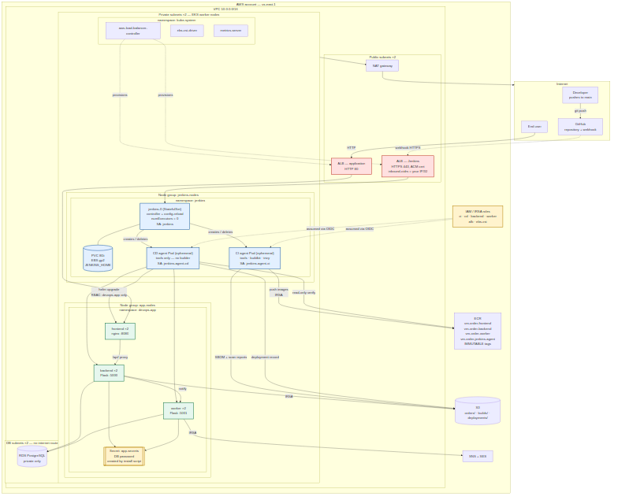
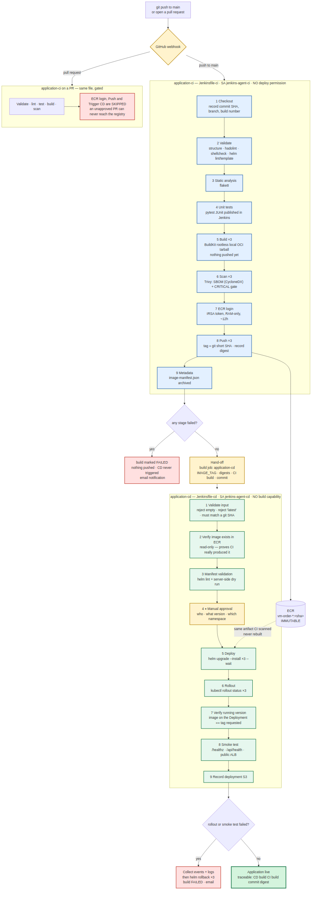

# VM Order Portal — Phase 4: Jenkins CI/CD inside Kubernetes

A multi-service application built, scanned and deployed by **two separate
Jenkins pipelines** running inside the same EKS cluster the application runs
in. Jenkins itself is installed from code — plugins, jobs, credentials and
agent templates are all reproducible; nothing is configured by hand in the UI.

Destroy the cluster, run `./scripts/deploy.sh`, and everything comes back
identically.

---

## Table of contents

1. [Architecture](#1-architecture)
2. [Prerequisites](#2-prerequisites)
3. [Quick start](#3-quick-start)
4. [Installing Jenkins from code](#4-installing-jenkins-from-code)
5. [The two jobs](#5-the-two-jobs)
6. [CI pipeline](#6-ci-pipeline)
7. [CD pipeline](#7-cd-pipeline)
8. [Rollback](#8-rollback)
9. [Credentials and secrets](#9-credentials-and-secrets)
10. [Security](#10-security)
11. [Cleanup](#11-cleanup)
12. [Trade-offs and decisions](#12-trade-offs-and-decisions)
13. [Testing](#13-testing)

> **New to this project?** [`docs/WALKTHROUGH.md`](docs/WALKTHROUGH.md) explains
> every file and every significant line — what it does and why it is written
> that way.

---

## 1. Architecture

**Environment: AWS EKS.** Jenkins runs in the same cluster as the application
but in a separate namespace, on a separate, tainted node group. Running it in
the same cluster keeps the project inside one VPC and one IAM boundary, and
lets CD authenticate to the Kubernetes API with a ServiceAccount token rather
than a stored kubeconfig — there is no cluster credential to leak. The security
boundary between Jenkins and the application is enforced by namespaces, RBAC,
NetworkPolicies and separate IAM roles rather than by a cluster boundary; §10
sets out exactly what each identity can and cannot do.

### Deployment view



<details><summary>Mermaid source (docs/architecture-deployment.mmd)</summary>

See [`docs/architecture-deployment.mmd`](docs/architecture-deployment.mmd).
</details>

### Pipeline flow



<details><summary>Mermaid source (docs/architecture-pipeline.mmd)</summary>

See [`docs/architecture-pipeline.mmd`](docs/architecture-pipeline.mmd).
</details>

### Layers and ownership

| Layer | Created by | Contains | Lifecycle |
|---|---|---|---|
| Infrastructure | Terraform | VPC, EKS (2 node groups), RDS, S3, SNS, ECR, IAM/IRSA | per cycle |
| Platform | `install-jenkins.sh` | ALB controller, EBS CSI, metrics-server, namespaces, app Secret, RBAC, NetworkPolicies, Jenkins | per cycle |
| Application | **Jenkins CD pipeline** | frontend, backend, worker | many times per cycle |

Terraform never creates Kubernetes application objects, and Jenkins never
creates AWS infrastructure.

### Namespaces

| Namespace | Contents |
|---|---|
| `jenkins` | controller Pod, ephemeral agent Pods |
| `devops-app` | frontend ×2, backend ×2, worker ×2 |
| `kube-system` | ALB controller, EBS CSI driver, metrics-server |

Nothing runs in `default` — `verify-jenkins.sh` asserts this.

---

## 2. Prerequisites

| Tool | Version | Notes |
|---|---|---|
| AWS CLI | v2 | `aws sts get-caller-identity` must work |
| Terraform | ≥ 1.5 | tested on 1.15 |
| kubectl | 1.34–1.36 | must be within ±1 minor of the cluster (1.35) |
| Helm | 3.15+ or 4.x | both work; the project uses no Helm-4-breaking features |
| Docker | any recent | needed once, to build the agent image |
| jq | any | used by the webhook script |

Also required:

- **A verified SES sender address** — the worker cannot send mail without it.
  `aws ses verify-email-identity --email-address you@example.com --region us-east-1`
- **A GitHub token** with `admin:repo_hook` scope, for webhook registration.
  Optional: without it CI falls back to a 5-minute SCM poll.

---

## 3. Quick start

```bash
git clone <your-fork> && cd VMOrderPortal_Phase4

cp terraform/terraform.tfvars.example terraform/terraform.tfvars
$EDITOR terraform/terraform.tfvars          # 5 values

export GITHUB_TOKEN=ghp_xxxxxxxx            # optional but recommended

./scripts/deploy.sh                          # ~30 minutes
```

### The five values in `terraform.tfvars`

| Variable | Notes |
|---|---|
| `db_password` | RDS master password. Rejects `/`, `@`, `"` and spaces. Never committed — the file is gitignored |
| `s3_bucket_name` | Must be globally unique across all of AWS, and lowercase. Add a random suffix |
| `notification_email` | Where SNS order alerts and Jenkins build emails go |
| `ses_sender` | The SES address you verified in §2 |
| `github_repo_url` | Your fork's HTTPS clone URL. Jenkins clones from here and the webhook is registered against it |

`terraform.tfvars` is the single source of truth: every script reads these
values back through `terraform output`, so nothing is duplicated or hard-coded.

`deploy.sh` runs, in order: `terraform apply` → `install-jenkins.sh` →
`create-jobs.sh` → `register-webhook.sh` → `verify-jenkins.sh`, and prints the
Jenkins URL, username and password at the end.

Then push a commit, or open Jenkins and run `application-ci` manually.

---

## 4. Installing Jenkins from code

Four scripts, each independently runnable and idempotent.

| Command | What it does |
|---|---|
| `./scripts/install-jenkins.sh` | Add-ons, namespaces, app Secret, RBAC, ServiceAccounts, NetworkPolicies, TLS certificate, agent image, Jenkins |
| `./scripts/configure-jenkins.sh` | Regenerates the JCasC config and applies it. Run this after your IP changes |
| `./scripts/create-jobs.sh` | Creates both jobs from `jenkins/jobs/seed.groovy` |
| `./scripts/verify-jenkins.sh` | ~35 assertions that the install matches the design |
| `./scripts/uninstall-jenkins.sh` | Removes Jenkins, its PVC and its ALB. The application is untouched |

Supporting scripts: `create-cert.sh` (self-signed certificate → ACM),
`register-webhook.sh` (GitHub webhook, re-registered each cycle).

**What is defined as code**

| Concern | File |
|---|---|
| Jenkins version | `jenkins/values.yaml` → `controller.image.tag` (pinned, never `latest`) |
| Chart version | `jenkins/CHART_VERSION` (pinned) |
| Plugins | `jenkins/values.yaml` → `installPlugins` |
| System config, agents cloud | `jenkins/values.yaml` → JCasC + chart values |
| Environment values | generated by `configure-jenkins.sh` from Terraform outputs |
| Jobs | `jenkins/jobs/seed.groovy` (Job DSL) |
| RBAC, ServiceAccounts | `jenkins/rbac.yaml` |
| Network isolation | `jenkins/networkpolicy.yaml` |
| Agent image | `jenkins/agent-tools/Dockerfile` |

**Reproducibility check:** `uninstall-jenkins.sh` then `install-jenkins.sh` and
`create-jobs.sh` restores an identical Jenkins with both jobs present. Build
history is lost by design; build artifacts are archived to S3 before teardown.

---

## 5. The two jobs

| Job | Type | Jenkinsfile | Trigger | ServiceAccount |
|---|---|---|---|---|
| `application-ci` | Multibranch pipeline | `Jenkinsfile-ci` | GitHub webhook (push + PR); 5-min poll fallback | `jenkins-agent-ci` |
| `application-cd` | Parameterised pipeline | `Jenkinsfile-cd` | Triggered by CI, or run manually with a tag | `jenkins-agent-cd` |

Both are created from `jenkins/jobs/seed.groovy` through JCasC and the job-dsl
plugin. Creating them by hand in the UI would not satisfy the reproducibility
requirement, and is never necessary.

### How CI hands off to CD

CI archives `image-manifest.json` — tag, per-image digest, commit, branch and
CI build number — and then calls `build job: 'application-cd'` with the tag and
digests as parameters.

This gives traceability in both directions:

- From a **CD build**: the parameters name the CI build, the git commit and the
  exact image digest deployed.
- From a **CI build**: the archived manifest records precisely what was
  produced and promoted.

CD can also be run manually with a tag typed in, which is how you redeploy or
roll forward to a previously built version.

---

## 6. CI pipeline

`Jenkinsfile-ci` — **contains no deploy stage.** Its ServiceAccount has no
Kubernetes deploy permission, so even a modified Jenkinsfile could not deploy.

| # | Stage | Purpose |
|---|---|---|
| 1 | Checkout | Records commit SHA, branch and build number |
| 2 | Validate | Project structure, hadolint ×4, shellcheck, `helm lint`, `helm template` |
| 3 | Static analysis | `flake8` (config and rationale in `setup.cfg`) |
| 4 | Unit tests | `pytest` → JUnit XML published to Jenkins (51 tests) |
| 5 | Build ×3 | Rootless BuildKit → local OCI tarball. **Nothing pushed yet** |
| 6 | Scan + SBOM | Trivy: CycloneDX SBOM per image, then a CRITICAL gate |
| 7 | ECR login | IRSA-issued token, RAM-only, ~12 h |
| 8 | Push ×3 | Tag = **git short SHA**; digest recorded via `--metadata-file` |
| 9 | Metadata | `image-manifest.json` archived |
| 10 | Trigger CD | `main` only |

**Scanning happens before pushing.** The build writes a tarball, Trivy scans
it, and only then does the push stage run — a CRITICAL finding means the image
never reaches the registry at all.

**Tagging.** The tag is the git short SHA. Never `latest`; and deliberately not
`BUILD_NUMBER`, which restarts at 1 whenever Jenkins is rebuilt and would then
collide with an existing IMMUTABLE ECR tag.

**Pull requests** run stages 1–6 and stop. `ECR login`, `Push` and `Trigger CD`
are gated on `IS_PR != true`, so an unapproved PR can never reach the registry
or the cluster.

**Failure behaviour.** Any failing stage fails the build, so the push never
happens and `application-cd` is never triggered. An email is sent. The
workspace and the ECR token are removed in `post { always }`.

---

## 7. CD pipeline

`Jenkinsfile-cd` — **contains no build stage.** Its agent Pod has no BuildKit
container and its IAM role has no `ecr:PutImage`.

| # | Stage | Purpose |
|---|---|---|
| 1 | Validate input | Rejects empty, rejects `latest`, requires a git-SHA-shaped tag and a permitted namespace |
| 2 | Verify image exists | Read-only ECR lookup — proves CI really produced this tag |
| 3 | Manifest validation | `helm lint` + server-side dry run |
| 4 | **Approval** | Manual gate showing who, what version, which namespace *(bonus)* |
| 5 | Deploy | `helm upgrade --install` ×3 `--wait` |
| 6 | Rollout | `kubectl rollout status` ×3 |
| 7 | Verify running version | Asserts the image on each Deployment matches the requested tag |
| 8 | Smoke test | `/healthz`, `/api/health`, then the public ALB |
| 9 | Record deployment | Deployment record, cluster state and Helm releases → S3 |

Every run prints who triggered it, the originating CI build, the git commit,
the tag, the digests, the cluster and the namespace.

**Concurrency:** `disableConcurrentBuilds()` prevents two deployments racing
into the same environment.

**The smoke test goes through the frontend, not straight to the backend.** The
backend NetworkPolicy accepts traffic only from pods labelled `app=frontend`,
so a direct call from the build agent is correctly refused. Testing through
nginx also exercises the real request path a user takes.

---

## 8. Rollback

**Automatic.** If rollout or the smoke test fails, the `post { failure }` block
collects pod status, recent events and container logs *first* — otherwise the
evidence disappears with the failed ReplicaSet — and then runs
`helm rollback` for all three releases.

**Manual.**

```bash
export HELM_DRIVER=configmap        # required: see §12

helm history backend -n devops-app
helm rollback backend 3 -n devops-app
kubectl rollout status deployment/backend -n devops-app
```

**Or redeploy a known-good version** through the pipeline, which is preferable
because it leaves an audit trail: run `application-cd` with `IMAGE_TAG` set to
the previous commit's short SHA.

Demonstrated rollback evidence: [`evidence/`](evidence/).

---

## 9. Credentials and secrets

Nothing sensitive is committed. `terraform.tfvars`, `*.tfstate`, `backend.tf`,
`*.token` and `.github_token` are all gitignored.

| Secret | Where the real value lives | Never appears in |
|---|---|---|
| DB password | `terraform/terraform.tfvars` on your machine → Kubernetes Secret | Git, Jenkins, build logs |
| AWS credentials | **do not exist** — IRSA only | anywhere |
| ECR token | generated per build, RAM-only, ~12 h | disk, Git, Jenkins |
| GitHub token | `$GITHUB_TOKEN` or `~/.github_token` on your machine | the cluster, Jenkins, Git |
| SES SMTP | Kubernetes Secret `jenkins-smtp` | Git |

Shapes and rotation/revocation procedures for every one:
[`jenkins/secret.example.yaml`](jenkins/secret.example.yaml).
Example Jenkins values: [`jenkins/values.example.yaml`](jenkins/values.example.yaml).

**Masking.** No pipeline echoes a secret. The ECR token is written with
`umask 077` and `chmod 600`, never printed, and `unset` immediately. Email
bodies contain only build metadata and links.

---

## 10. Security

### RBAC

No `cluster-admin`, no wildcard verbs, no ClusterRole. Three ServiceAccounts,
each with one job:

| Identity | Can | Cannot |
|---|---|---|
| `jenkins` (controller) | create/delete agent Pods in `jenkins` | anything in `devops-app` |
| `jenkins-agent-ci` | push images to ECR (IRSA) | **any** Kubernetes deploy; read Secrets |
| `jenkins-agent-cd` | manage app objects in `devops-app` | create Pods; push images; read Secrets |

`jenkins-agent-ci` has **no Role and no RoleBinding at all** — its only
Kubernetes capability is existing as a Pod.

Two properties worth stating explicitly, both asserted by `verify-jenkins.sh`:

- **CI cannot deploy.** `kubectl auth can-i create deployments -n devops-app
  --as=system:serviceaccount:jenkins:jenkins-agent-ci` → `no`.
- **Jenkins cannot read the database password.** `secrets` is granted to
  nobody. Helm normally stores release history as Secrets, so both pipelines
  set `HELM_DRIVER=configmap` — we changed Helm rather than weakening the
  permission.

The one broad permission in the project is `ecr:GetAuthorizationToken` on
`"*"`, which the AWS API requires to be account-wide. Every other ECR action is
scoped to the four project repositories, and every S3 action to a single
prefix.

### Agents and container security

- Builds never run on the controller (`numExecutors: 0`, asserted at runtime).
- **No `/var/run/docker.sock` is mounted anywhere.** Images are built with
  **rootless BuildKit**.
- Agent containers: `runAsNonRoot`, `runAsUser: 1000`,
  `allowPrivilegeEscalation: false`, `capabilities: drop [ALL]`,
  `seccompProfile: RuntimeDefault`, explicit requests and limits.
- Workspaces are ephemeral `emptyDir`s deleted with the Pod; the ECR credential
  volume is RAM-backed (`medium: Memory`) so the token never touches node disk.
- Both agent and controller images are pinned and Trivy-scanned.

**Two documented exceptions, both scoped to the `buildkit` container only:**
`seccompProfile: Unconfined`, an AppArmor `unconfined` annotation, and
`--oci-worker-no-process-sandbox`. Rootless BuildKit cannot otherwise create
the namespaces a `RUN` step needs. The alternative — Docker-in-Docker with
`privileged: true` — would grant access to all host devices and kernel
capabilities. This is a far narrower concession, and it applies to one
container in one namespace; application pods keep `RuntimeDefault` with no
exceptions.

### Network

- Jenkins is **not** open to the internet: the ALB is restricted to your
  current public IP (`inbound-cidrs`), re-detected on every install.
- **HTTPS** via a self-signed certificate imported into ACM, TLS 1.3 policy,
  HTTP redirected to 443. See §12 for why not a public certificate.
- NetworkPolicies in `jenkins`: default-deny in and out, with narrow allows.
  Egress excludes `169.254.169.254/32`, so a malicious build cannot reach
  instance metadata and steal the node role, bypassing IRSA.
- Application NetworkPolicies (from phase 3) are unchanged: only frontend pods
  may reach the backend.

**Endpoints required:** GitHub (443, clone + webhook), ECR and STS (443, via
NAT), the Kubernetes API (443, in-VPC), `updates.jenkins.io` (443, plugins),
Trivy's vulnerability database (443).

---

## 11. Cleanup

```bash
./scripts/uninstall-jenkins.sh     # Jenkins only; application keeps running
./scripts/destroy.sh               # everything, ~15 minutes
```

`destroy.sh` handles the ordering that AWS requires: uninstall Jenkins → delete
its PVC (an EBS volume Terraform does not know about) → remove ALB controller
webhooks → uninstall app charts (frontend first, it owns the ALB) → wait for
both ALBs → empty S3 including versioned objects → sweep orphaned ENIs **and
orphaned ALB-controller security groups** → `terraform destroy`, with one
automatic retry.

Verify nothing is left:

```bash
aws eks list-clusters --region us-east-1
aws ec2 describe-volumes --region us-east-1 --filters Name=status,Values=available
aws elbv2 describe-load-balancers --region us-east-1
```

**Download build evidence from Jenkins before destroying** — `destroy.sh`
empties the S3 bucket.

---

## 12. Trade-offs and decisions

**Jenkins in the same cluster as the application.** Simpler and cheaper, and CD
authenticates with a ServiceAccount token instead of a stored kubeconfig. The
cost is that a Jenkins compromise is inside the cluster, which is why the RBAC,
NetworkPolicy and IAM separation in §10 carries the weight. A separate cluster
would be stronger and roughly doubles the control-plane cost.

**Self-signed certificate rather than a registered domain.** An ALB can only
terminate TLS with an ACM certificate, and a publicly trusted one requires a
domain. A `.com` is about $12/year plus $0.50/month for the hosted zone, and
would also need a DNS record updated on every cycle because the ALB hostname
changes. We import a self-signed certificate instead: real TLS 1.3, real
encryption, one browser warning. The webhook is registered with
`insecure_ssl: 1` for the same reason — the payload is a commit SHA and a repo
name, and the endpoint is IP-restricted, but it is a genuine trade-off.

**`HELM_DRIVER=configmap`.** Helm's default Secret storage would require
`list` on secrets, and RBAC cannot scope `list` to one named object — granting
it would expose the DB password. ConfigMaps carry the same data with none of
that exposure. The catch: *whoever reads a release must use the same driver*,
which is why `destroy.sh` sets it for the three app charts and not for the
add-ons installed from the workstation.

**Plugins not version-pinned, chart pinned instead.** The plugin installer
resolves dependencies to their latest versions, which demand a recent core.
Pinning plugins against an older core produces a crash-looping controller. The
version that actually controls the outcome is the chart version (which
determines the core image), so that is what is pinned.

**Kubernetes 1.35.** A version outside EKS standard support is billed at
$0.60/cluster/hour instead of $0.10 and EKS enrols you automatically. Pinning
is right; leaving a pin unreviewed turned out to be a 6× cost multiplier.

**Free-tier instance types.** AWS accounts created on or after 2025-07-15 are
hard-restricted to a small list of instance types. `t3.medium` is not on it, so
the Jenkins node group uses `m7i-flex.large` (2 vCPU / 8 GiB), which is both
permitted and larger.

**Scan before push.** Costs an extra BuildKit invocation (a cache hit, seconds)
and disk for the tarballs. Buys the guarantee that a CRITICAL-vulnerable image
never enters the registry.

**Cosign image signing is not implemented.** SBOMs are generated and archived;
signing needs key management and a signature store, and was deferred in favour
of completing the required work. It is the obvious next step.

---

## 13. Testing

```bash
bash tests/run_all.sh          # ~90 static and mock checks
python3 -m pytest app/ -v      # 51 application unit tests
flake8 app/                    # lint
./scripts/verify-jenkins.sh    # ~35 live cluster assertions
```

The QA suite runs offline against mocked binaries: it lints every script and
manifest, renders every chart, walks `deploy.sh` and `destroy.sh` end to end
against fake `aws`/`kubectl`/`helm`/`terraform`, and asserts call ordering.

Group **T14** contains regression tests for bugs actually hit during this
project — Terraform module cycles, non-free-tier instance types, JCasC key
conflicts, Ingress `pathType`, agent volume collisions, rootless BuildKit
settings, `kubectl get all` permission overreach, and masked S3 upload
failures. Each one cost real debugging time; none can silently return.

---

## 14. Troubleshooting

Every row below is a failure actually hit while building this project.

| Symptom | Cause | Fix |
|---|---|---|
| `Permission denied` on a script | executable bit lost in transfer | `chmod +x scripts/*.sh tests/*.sh tests/mocks/*` |
| `terraform apply` cycle error | stale `.terraform` from a copied folder | `rm -rf terraform/.terraform && terraform init` |
| `jenkins-0` Pending | PVC unbound or taint mismatch | `kubectl describe pod jenkins-0 -n jenkins` |
| Jenkins URL times out | your IP changed since deploy | re-run `./scripts/configure-jenkins.sh` |
| Pipeline stuck "waiting for agent" | RBAC or nodeSelector | `kubectl get pods -n jenkins`, then `kubectl describe` the agent pod |
| Deploy stage `forbidden` | `jenkins-agent-cd` not bound, or Helm using the Secret driver | `./scripts/verify-jenkins.sh`; check `HELM_DRIVER=configmap` |
| Build push fails `tag immutable` | that commit was already built | ECR tags are immutable by design; commit again or delete the old image |
| Pods `ImagePullBackOff` | tag not in ECR | `aws ecr describe-images --repository-name vm-order-backend` — CD checks this before deploying |
| `terraform destroy` hangs on VPC 10+ min, no ENIs found | ALB-controller security groups (`k8s-traffic-*`, `k8s-<ns>-<ingress>-*`) survive the ALB and block VPC deletion | the script now sweeps them before destroy; manually: revoke ingress+egress rules, then `aws ec2 delete-security-group` |
| Node group `CREATE_FAILED`, `not eligible for Free Tier` | account created on/after 2025-07-15 is hard-restricted to t3.micro, t3.small, t4g.micro, t4g.small, c7i-flex.large, m7i-flex.large | use one of those types; delete the failed node group, then re-run `deploy.sh` |
| Node group stuck `CREATING` 20+ min, `health.issues` empty, no ASG | launch is being rejected but not yet surfaced | `aws autoscaling describe-scaling-activities` names the real cause |
| `failed calling webhook "mservice.elbv2.k8s.aws"`, `x509: certificate signed by unknown authority` | ALB controller was re-upgraded; its webhook CA was regenerated but running pods still serve the old cert | `kubectl rollout restart deployment/aws-load-balancer-controller -n kube-system` (the bootstrap now does this automatically) |
| Jenkins init container `CrashLoopBackOff`, `requires a greater version of Jenkins` | pinned plugin versions pull dependencies needing a newer core than the chart ships | update `jenkins/CHART_VERSION` from `helm search repo jenkins/jenkins --versions`; do not pin plugin versions |
